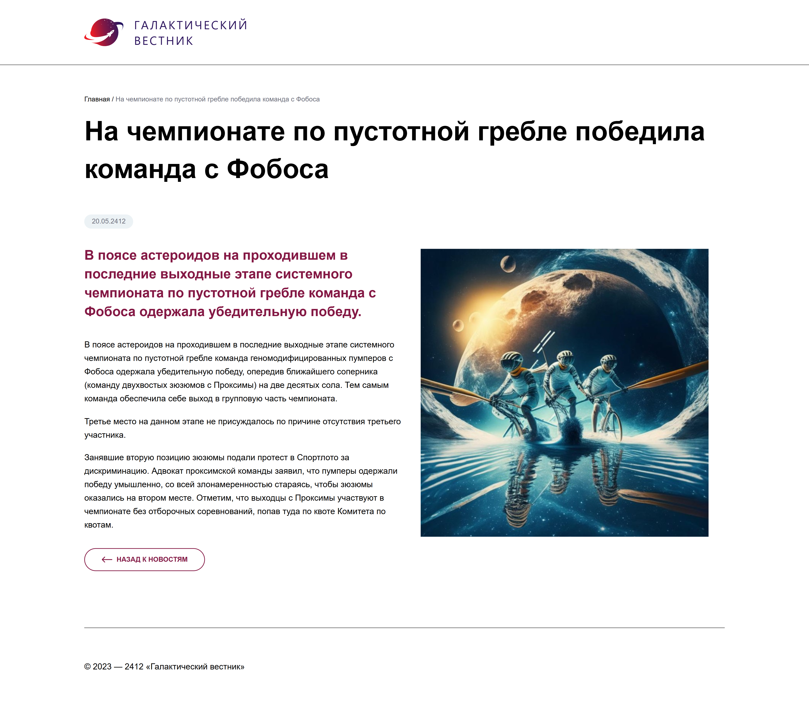

## Мини-сайт новостей (PHP / MySQL / MVC) ##

Демо: https://solomatinyarik.tech

Проект представляет собой мини-сайт новостей, разработанный как тестовое задание для стажировки.

Проект реализован с использованием PHP, MySQL, HTML и CSS без применения сторонних фреймворков и CMS, в соответствии с дизайн-макетом в Figma.

Сайт отображает список новостей с постраничной навигацией и представляет возможность просмотра детальной страницы каждой новости.

### О проекте ###

- Проект реализован на MVC-архитектуре, разработанной вручную, без применения сторонних фреймворков.
- Код написан на языке PHP с использованием принципов ООП.
- СУБД - MySQL. Подключение к БД через PDO.
- Адаптивная верстка с использованием относительных единиц измерения.

 

  

